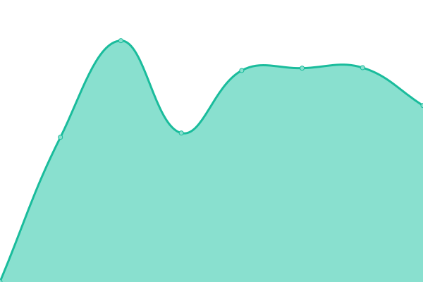

# [📈 Live Status](https://LuckUVeryX.github.io/luckuveryx-upptime): <!--live status--> **🟧 Partial outage**

This repository contains the open-source uptime monitor and status page for [Ryan Yip](https://LuckUVeryX.github.io/luckuveryx-upptime), powered by [Upptime](https://github.com/upptime/upptime).

With [Upptime](https://upptime.js.org), you can get your own unlimited and free uptime monitor and status page, powered entirely by a GitHub repository. We use [Issues](https://github.com/LuckUVeryX/luckuveryx-upptime/issues) as incident reports, [Actions](https://github.com/LuckUVeryX/luckuveryx-upptime/actions) as uptime monitors, and [Pages](https://LuckUVeryX.github.io/luckuveryx-upptime) for the status page.

<!--start: status pages-->
<!-- This summary is generated by Upptime (https://github.com/upptime/upptime) -->
<!-- Do not edit this manually, your changes will be overwritten -->
<!-- prettier-ignore -->
| URL | Status | History | Response Time | Uptime |
| --- | ------ | ------- | ------------- | ------ |
|  [LuckUVeryX](https://luckuveryx.github.io/) | 🟩 Up | [luck-u-very-x.yml](https://github.com/LuckUVeryX/luckuveryx-upptime/commits/HEAD/history/luck-u-very-x.yml) | 

 130ms
     
 | 

<a href="https://LuckUVeryX.github.io/luckuveryx-upptime/history/luck-u-very-x">100.00%</a>
    

|  [Glints Staging](https://staging.glints.com/) | 🟩 Up | [glints-staging.yml](https://github.com/LuckUVeryX/luckuveryx-upptime/commits/HEAD/history/glints-staging.yml) | 

 2943ms
     
 | 

<a href="https://LuckUVeryX.github.io/luckuveryx-upptime/history/glints-staging">100.00%</a>
    

|  [Glints Staging Emp](https://employers.staging.glints.com/) | 🟩 Up | [glints-staging-emp.yml](https://github.com/LuckUVeryX/luckuveryx-upptime/commits/HEAD/history/glints-staging-emp.yml) | 

 818ms
     
 | 

<a href="https://LuckUVeryX.github.io/luckuveryx-upptime/history/glints-staging-emp">100.00%</a>
    

|  [Evolve MMA](https://book.evolve-mma.com/) | 🟩 Up | [evolve-mma.yml](https://github.com/LuckUVeryX/luckuveryx-upptime/commits/HEAD/history/evolve-mma.yml) | 

 184ms
     
 | 

<a href="https://LuckUVeryX.github.io/luckuveryx-upptime/history/evolve-mma">100.00%</a>
    

|  [Singapore Oceanarium](https://www.singaporeoceanarium.com/) | 🟥 Down | [singapore-oceanarium.yml](https://github.com/LuckUVeryX/luckuveryx-upptime/commits/HEAD/history/singapore-oceanarium.yml) | 

 83ms
     
 | 

<a href="https://LuckUVeryX.github.io/luckuveryx-upptime/history/singapore-oceanarium">0.00%</a>
    

|  [Singapore Oceanarium Ticketing](https://www.singaporeoceanarium.com/en/ticketing/) | 🟥 Down | [singapore-oceanarium-ticketing.yml](https://github.com/LuckUVeryX/luckuveryx-upptime/commits/HEAD/history/singapore-oceanarium-ticketing.yml) | 

 12ms
     
 | 

<a href="https://LuckUVeryX.github.io/luckuveryx-upptime/history/singapore-oceanarium-ticketing">0.00%</a>
    

<!--end: status pages-->

[**Visit our status website →**](https://LuckUVeryX.github.io/luckuveryx-upptime)

## 📄 License

- Powered by: [Upptime](https://github.com/upptime/upptime)
- Code: [MIT](./LICENSE) © [Anand Chowdhary](https://anandchowdhary.com), supported by [Pabio](https://pabio.com)
- Data in the `./history` directory: [Open Database License](https://opendatacommons.org/licenses/odbl/1-0/)
